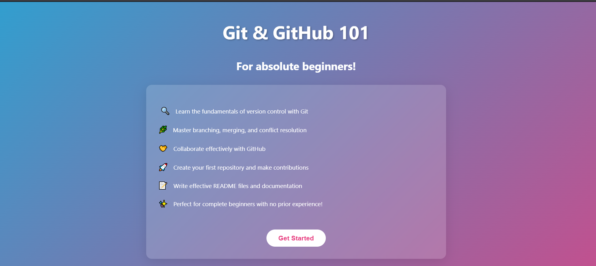

# Git & GitHub 101: For absolute beginners!

A simple web-based introduction to Git and GitHub designed specifically for those with no prior experience.



## Overview

This project provides beginners with an interactive introduction to version control using Git and collaboration through GitHub. The colorful, animated landing page welcomes newcomers and breaks down complex concepts into easy-to-understand sections.

## Features

- Fundamentals of version control with Git
- Branching, merging, and conflict resolution techniques
- GitHub collaboration basics
- Step-by-step guide to creating your first repository
- Tips for writing effective README files and documentation

## Getting Started

1. Clone this repository:
   ```
   git clone https://github.com/yourusername/git-github-101.git
   ```

2. Open `index.html` in your browser to view the landing page.

3. Click the "Get Started" button to begin the tutorial.

## Technologies Used

- HTML5
- CSS3 (with animations)
- JavaScript (for interactive elements)

## Contributing

Contributions are welcome! If you'd like to improve this tutorial:

1. Fork the repository
2. Create your feature branch (`git checkout -b feature/amazing-improvement`)
3. Commit your changes (`git commit -m 'Add some amazing improvement'`)
4. Push to the branch (`git push origin feature/amazing-improvement`)
5. Open a Pull Request

## Acknowledgments

- All the beginners who inspired this project
- The Git and GitHub communities for their amazing tools